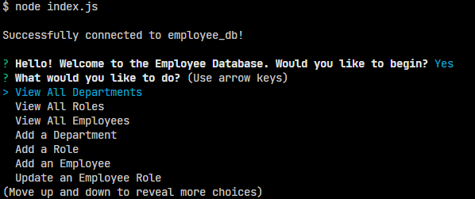
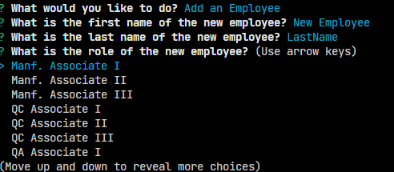
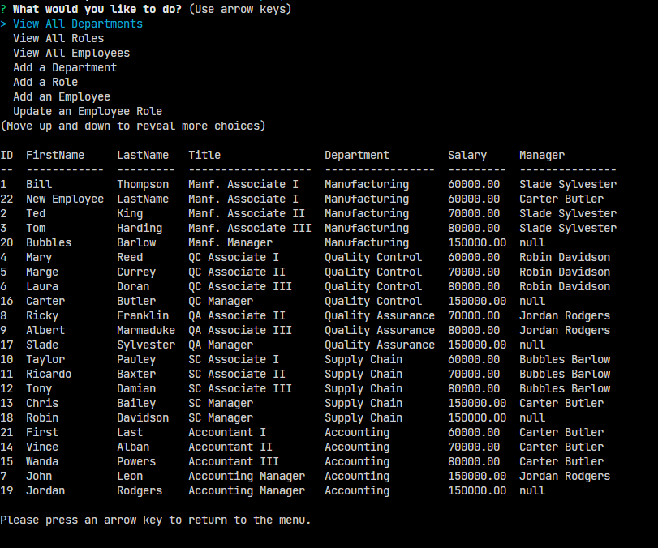

# README

## Description

This an employee management system using a MySQL database and Node.js

## Table of Contents

[License](#license)

[Features](#features)

[Contact Me](#contact-me)

## License:

This project is licensed under the MIT License

---

## Features:

You can launch the command line application after running an "npm install" and then adding a .env with SQL credentials. A schema.sql file and seed data are provided in the repo.

The above image shows the landing page and initial prompts.

Selecting an option will prompt user input to add to database.

Or simply display the database.
Below you can see a video demo of the application in use:

https://user-images.githubusercontent.com/103338620/182002076-315e8663-4dfc-442e-833f-3ea5eae6550b.mp4

## Contact Me:

Please feel free to reach out to me here on github!

[My Github](https://github.com/brisco13)
